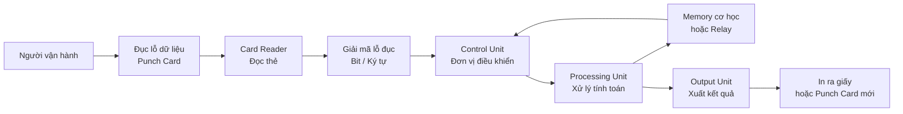
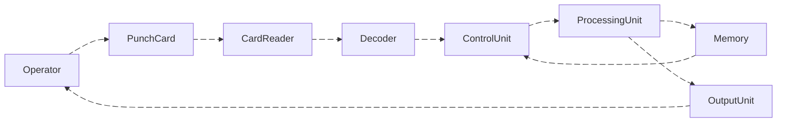

# Mở bài
Trước khi đi vào cách một máy tính đục lỗ hoạt động ra sao, ta cần phải tìm hiểu xem nguồn gốc của punched card(thẻ đục lỗ) có từ đâu.

[How a "punch card" weaving machine, invented by Joseph Jacquard in 1801, worked - YouTube](https://www.youtube.com/watch?v=qG-OXlIQgZo)

[The Virtual Keypunch – Make Your Personal Punch Card](https://www.masswerk.at/keypunch/)
