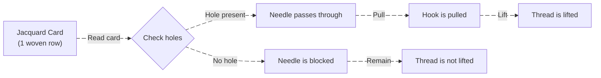

# Origins

Before examining how a punched-card computer works, it is essential to understand where **punched cards** originated and why humans conceived the idea of storing information using holes on a physical medium.

---

## The Jacquard Loom

In the late 18th and early 19th centuries, the textile industry was among the most complex manufacturing sectors. Producing multi-layered patterns required:

- Highly skilled artisans  
- Extremely precise manual work  
- Almost no possibility of automation  

In **1804**, **Joseph Marie Jacquard** introduced the [Jacquard machine – Wikipedia](https://en.wikipedia.org/wiki/Jacquard_machine), which used **punched cards** to control the weaving process.

### Operating Mechanism


|  |  |
| ------------------------------------------------------------------------------------------------------------------------------------------------------- | ---------------------------------------------------------------------------------------------------------------------------------------------------------------------------- |




### Interpreted in Modern Computing Terms

|Jacquard System|Modern Computer Analogy|
|---|---|
|Hole|1|
|No hole|0|
|One card|One instruction/file|
|Card sequence|Program|
|Loom|Mechanical CPU|

A continuous chain of cards forms:

- A **program**
- Executed **sequentially**
- Easily modified by replacing the card set

```callout
[!NOTE] Conceptual Significance
Although the Jacquard loom was not a computer, it laid the intellectual foundation of computing:
1. Separation of **program** from **machine**
2. Data encoded as **physical binary**
3. Automation driven by data rather than human judgment
```

---

## Herman Hollerith & the U.S. Census


|  |  |
| ----------------------------------------------------------------------------------------------------------------------- | --------------------------------------------------------------------------------------------------------- |


By the late 19th century, the United States faced a serious challenge: population growth had outpaced the capacity of manual data processing.

- The **1880 census** required nearly **8 years** to tabulate
- At that rate, the **1890 census** risked overlapping with the next census cycle

**Herman Hollerith** revolutionized data storage by encoding information instead of recording full textual descriptions. In essence, data was stored in a **minimal, structured, yet lossless format**.


---

## How Information Was Stored on Hollerith Cards

Readers should not focus excessively on the printed characters on the cards. These symbols merely reflect predefined conventions. Without knowing the mapping rules, the symbols are naturally meaningless.

Hollerith cards were designed for reuse across multiple data-processing tasks, not solely for census work. Therefore, their structure consisted of two main parts:


1. **Identification & Convention Layer**
    - Defines the type of data stored
    - Enables both humans and machines to interpret rows and columns correctly
        
2. **Encoded Information Layer**
    - Represents **ranges**, not literal values
    - Stored through the **presence or absence of holes**
        

### Census Example

Instead of storing:

> _Male, 32 years old, single, factory worker, immigrant_

The system encoded attributes:
- Column 5: Gender
- Columns 6–7: Age group
- Column 8: Marital status
- Column 9: Occupation
- Column 10: Nationality
    

Age mapping example:

|Row|Age Range|
|---|---|
|1|0–9|
|2|10–19|
|3|20–29|
|4|30–39|

Through predefined mappings, data became **compact**, **fast to process**, and **scalable**.

---

## Overview of the Hollerith System


Hollerith did not invent a single machine; he created a **complete data-processing pipeline**.


### Processing Stages

#### Stage 1: Data Collection

- Census workers recorded responses on paper
- Data was unstructured and human-readable only

#### Stage 2: Encoding to Punched Cards

- One card represented one individual
- Card positions were standardized
- Holes were punched manually and visually verified
    
#### Stage 3: Card Reading — the System’s Core

- Metal pins probed each card position
- A hole closed an electrical circuit
- The circuit activated the corresponding counter
    

#### Stage 4: Aggregation & Statistics


**Mechanical Counters**

- Each counter represents a statistical group.

- Configurations can be reassigned depending on the problem.

Examples:

- Counter 1: Male
- Counter 2: Female
- Counter 3: Over 40 years old
- Counter 4: Farmer

One card can activate multiple counters simultaneously.

👉 This is `vectorized processing` at the mechanical level.

---

**Cross-tabulation**

The most advanced feature of the Hollerith system is its ability to:

> Count multiple attributes simultaneously on the same record

By:

- Configuring the circuit
- Assigning counters
- Running multiple reading cycles

Examples:

- Cycle 1: Gender statistics → 1000 people are female
- Cycle 2: Occupation statistics → 450 people are mechanics, 550 people are housewives
- Cycle 3: State statistics → 100 people belong to state A, 200 people belong to state B, ...

> This is the precursor to:
> - `GROUP BY`
> - `FILTER`
> - `MULTI-PASS DATA PROCESSING`

---
#### Stage 5: Sorting & Classification

- Cards were physically routed into bins
- Equivalent to:
    - `Sharding`
    - `Bucket sort`
        

---

## Key Achievements of the Hollerith System

Despite having:
- No CPU
- No RAM
- No software
    

It still achieved:
- Data abstraction
- Logical processing
- Batch execution
- Large-scale automation
    

```callout
[!IMPORTANT] Historical Impact
1. The 1890 census was completed significantly faster  
2. Marked the birth of:
   - Electrical data processing
   - Batch data processing systems
```

Eventually, Hollerith’s companies merged, forming [IBM - International Business Machines](https://www.ibm.com/us-en).

---

## The Birth of IBM and the IBM 029

As Hollerith systems expanded beyond census work, IBM standardized:

- Card dimensions
- Processing workflows

The goal is to store and encrypt more types of information.

The result was the **80-column punched card**:
- 12 rows × 80 columns
- Each column represented one character
- Characters encoded by hole combinations
    
With standard IBM cards, IBM not only stores information but also programs. Indeed, each card itself can be configured to specify what type of information will be entered.


Machines like the **IBM 029 Keypunch** modernized the same principles with improved electromechanical technology.


---

## References

- [Jacquard machine – Wikipedia](https://en.wikipedia.org/wiki/Jacquard_machine)
- [Binary and the Jacquard Mechanism – YouTube](https://www.youtube.com/watch?v=pzYucg3Tmho)
- [1889 Herman Hollerith Census Machine by TMC which became IBM - YouTube](https://www.youtube.com/watch?v=9HXjLW7v-II)
- [Hollerith tabulating machine – Wikipedia](https://en.wikipedia.org/wiki/Tabulating_machine)
- [IBM 029 Card Punch – IBM Archives](https://www.ibm.com/ibm/history/exhibits/vintage/vintage_4506VV4024.html)
- [Anatomy of a Hollerith Card](https://www.eecis.udel.edu/~mills/gallery/gallery9.html)
- [Hollerith 1890 Census Tabulator](https://www.columbia.edu/cu/computinghistory/census-tabulator.html)
- [The punched card \| IBM](https://www.ibm.com/history/punched-card)
- [EBCDIC - Wikipedia](https://en.wikipedia.org/wiki/EBCDIC)
- [1964 IBM 029 Keypunch Card Punching Demonstration - YouTube](https://www.youtube.com/watch?v=YnnGbcM-H8c)
- [The Virtual Keypunch – Make Your Personal Punch Card](https://www.masswerk.at/keypunch/)
