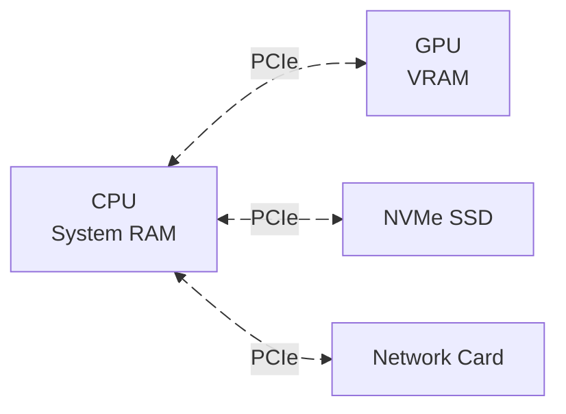

## Barrier
---
A barrier is a synchronization primitive that controls the order of operations in the GPU command stream. It essentially says:

```callout
[!IMPORTANT] It essentially says:
Wait here until previous operations finish, then make sure the results are visible before continuing.
```

Think of it like a checkpoint in the GPU's work pipeline. GPUs execute commands asynchronously and out-of-order when possible for performance. Without barriers, we might have problems like:

- reading from an image before write to it has finished
- using an image in the wrong memory layout
- different parts of the GPU trying to access the same memory simultaneously

Barriers prevent these issues by enforcing the ordering and visibility.

## Image Layout
---
An image layout - `VkImageLayout` describes how an image's data physically organized in GPU memory. Different layouts are optimized for different operations.

```callout
[!IMPORTANT] Think of it like this
The same image data can be arranged in memory in different ways, and some arrangements are faster for certain operations than others.
```

The GPU can access memory much faster when the data is organized optimally for the specific operation. For example:

- **Rendering to an image**: You want pixel data arranged so the GPU's render units can write efficiently
- **Sampling in a shader**: You want data arranged so the texture units can read quickly (often with special cache-friendly patterns)
- **Copying data**: You want a simple linear arrangement for fast memory transfers

## Transition Layout
---
In Vulkan, a transition layout refers to the process of changing an image layout - `VkImageLayout` from one state to another to prepare it for different operations.

An image must be correct layout before you perform an operation on it, or you'll get undefined behavior or validation errors.


## PCI & PCIe
---


$$
\begin{aligned}
PCI &= \text{Peripheral Component Interconnect} \\
PCIe &= \text{PCI Express}
\end{aligned}
$$





**PCIe** (PCI Express) is the high-speed bus that connects:

- CPU ↔ GPU (graphics card)
- CPU ↔ Other devices (SSDs, network cards, etc.)

It's like a highway for data transfer between components.

### Memory Access Across PCIe

The GPU has its own memory (VRAM) separate from system RAM. Data must travel across the PCIe bus to get between them.

1. **Device-local memory (VRAM)**
    - Lives on the GPU side
    - GPU accesses it directly (fast)
    - CPU must go through PCIe to access (slow or impossible)
2. **Host-visible memory**
    - Could be system RAM
    - Could be a small portion of VRAM mapped for CPU access
    - Requires PCIe transfers
3. **Shared memory (BAR - Base Address Register)**
    - A region of GPU memory mapped into CPU address space
    - CPU can write directly, but still goes through PCIe
    - Limited size traditionally (256MB), but newer systems support "Resizable BAR"

## GPU Memory Types in Vulkan
---
Vulkan exposes different memory types through **memory poperty flags**. The actual number of combinations depend on the device's hardware.


| Count | Flag                                      | Meaning                                                                                                                          |
| ----- | ----------------------------------------- | -------------------------------------------------------------------------------------------------------------------------------- |
| 1     | `VK_MEMORY_PROPERTY_DEVICE_LOCAL_BIT`     | - memory physically on GPU<br>- Faster for GPU to access<br>- usually NOT accessible by CPU                                      |
| 2     | `VK_MEMORY_PROPERTY_HOST_VISIBLE_BIT`     | - CPU can map and access this memory<br>- required if we want to write from CPU                                                  |
| 3     | `VK_MEMORY_PROPERTY_HOST_COHERENT_BIT`    | - automatic synchronization between CPU and GPU<br>- no need to manually flush/invalidate<br>- slightly slower than non-coherent |
| 4     | `VK_MEMORY_PROPERTY_HOST_CACHED_BIT`      | - is cached on CPU side<br>- faster for CPU reads<br>- need to flush/invalidate manually                                         |
| 5     | `VK_MEMORY_PROPERTY_LAZILY_ALLOCATED_BIT` | - only allocated when actually used<br>- good for transient attackments                                                          |
| 6     | `VK_MEMORY_PROPERTY_PROTECTED_BIT`        | protected memory (for DRM content)                                                                                               |

## Staging Buffer
---
A staging buffer is a temporary buffer that sits between the CPU and the GPU's optimal memory.


```img_compare
- [Mipmap Lv 0](https://github.com/hoangcuongzk1/hoangcuongzk1.github.io/blob/main/docs/shared/post-07/mip_lv0.png?raw=true)
- [Mipmap Lv 2](https://github.com/hoangcuongzk1/hoangcuongzk1.github.io/blob/main/docs/shared/post-07/mip_lv2.png?raw=true)
```

## offscreen buffer

## MSAA

```img_compare
- [MSAA ON](https://github.com/hoangcuongzk1/hoangcuongzk1.github.io/blob/main/docs/shared/post-07/msaa_on.png?raw=true)
- [MSAA OFF](https://github.com/hoangcuongzk1/hoangcuongzk1.github.io/blob/main/docs/shared/post-07/msaa_off.png?raw=true)
```
