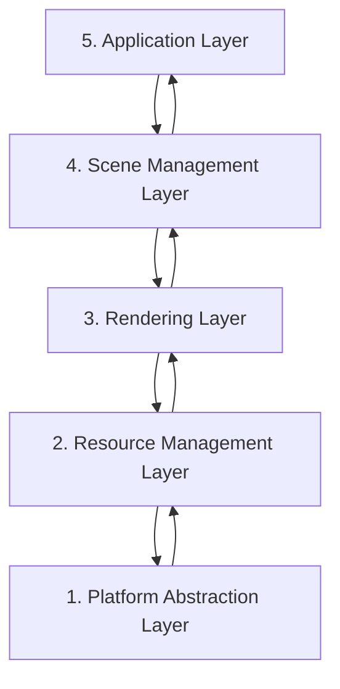

# References
---
- [games-1312234642.cos.ap-guangzhou.myqcloud.com/course/GAMES104/GAMES104\_Lecture02.pdf](https://games-1312234642.cos.ap-guangzhou.myqcloud.com/course/GAMES104/GAMES104_Lecture02.pdf)
- [Appendix: :: Vulkan Documentation Project](https://docs.vulkan.org/tutorial/latest/Building_a_Simple_Engine/Appendix/appendix.html#layered-architecture)

# Layer pattern
---
One of the most fundamental architectural patterns is the layered architecture, where the system is divided into distinct layers, each with a specific responsibility.



1. **Platform Abstraction Layer** - Provides a consistent interface to platform-specific functionality.
    
2. **Resource Management Layer** - Manages loading, caching, and unloading of assets.
    
3. **Rendering Layer** - Handles the rendering pipeline, shaders, and graphics API interaction.
    
4. **Scene Management Layer** - Manages the scene graph, spatial partitioning, and culling.
    
5. **Application Layer** - Handles user input, game logic, and high-level application flow.

## Benefits of Layered Architecture

- Clear separation of concerns
    
- Easier to understand and maintain
    
- Can replace or modify individual layers without affecting others
    
- Facilitates testing of individual layers

## Implementation Example

```cpp
// Platform Abstraction Layer
class Platform {
public:
    virtual void Initialize() = 0;
    virtual void* CreateWindow(int width, int height) = 0;
    virtual void ProcessEvents() = 0;
    // ...
};

// Resource Management Layer
class ResourceManager {
public:
    virtual Texture* LoadTexture(const std::string& path) = 0;
    virtual Mesh* LoadMesh(const std::string& path) = 0;
    // ...
};

// Rendering Layer
class Renderer {
public:
    virtual void Initialize(Platform* platform) = 0;
    virtual void RenderScene(Scene* scene) = 0;
    // ...
};

// Scene Management Layer
class SceneManager {
public:
    virtual void AddEntity(Entity* entity) = 0;
    virtual void UpdateScene(float deltaTime) = 0;
    // ...
};

// Application Layer
class Application {
private:
    Platform* platform;
    ResourceManager* resourceManager;
    Renderer* renderer;
    SceneManager* sceneManager;

public:
    void Run() {
        platform->Initialize();
        renderer->Initialize(platform);

        // Main loop
        while (running) {
            platform->ProcessEvents();
            sceneManager->UpdateScene(deltaTime);
            renderer->RenderScene(sceneManager->GetActiveScene());
        }
    }
};
```


# Data-Oriented Design
---
Data-Oriented Design (DOD) focuses on organizing data for efficient processing, rather than organizing code around objects.


## Key Concepts

1. **Data Layout** - Organizing data for cache-friendly access patterns.
    
2. **Systems** - Process data in bulk, often using SIMD instructions.
    
3. **Entity-Component-System (ECS)** - A common implementation of DOD principles.
    

## Benefits of Data-Oriented Design

- Better cache utilization
    
- More efficient memory usage
    
- Easier to parallelize
    
- Can lead to significant performance improvements

## Implementation Example

```cpp
// A simple ECS implementation
struct TransformData {
    std::vector<glm::vec3> positions;
    std::vector<glm::quat> rotations;
    std::vector<glm::vec3> scales;
};

struct RenderData {
    std::vector<Mesh*> meshes;
    std::vector<Material*> materials;
};

class TransformSystem {
private:
    TransformData& transformData;

public:
    TransformSystem(TransformData& data) : transformData(data) {}

    void Update(float deltaTime) {
        // Process all transforms in bulk
        for (size_t i = 0; i < transformData.positions.size(); ++i) {
            // Update transforms
        }
    }
};

class RenderSystem {
private:
    RenderData& renderData;
    TransformData& transformData;

public:
    RenderSystem(RenderData& rData, TransformData& tData)
        : renderData(rData), transformData(tData) {}

    void Render() {
        // Render all entities in bulk
        for (size_t i = 0; i < renderData.meshes.size(); ++i) {
            // Render mesh with transform
        }
    }
};
```


# Service Locator Pattern
---
The Service Locator pattern provides a global point of access to services without coupling consumers to concrete implementations.


## Key Concepts

1. **Service Interface** - Defines the contract for a service.
    
2. **Service Provider** - Implements the service interface.
    
3. **Service Locator** - Provides access to services.
    

## Benefits of Service Locator Pattern

- Decouples service consumers from service providers
    
- Allows for easy service replacement
    
- Facilitates testing with mock services

## Implementation Example

```cpp
// Audio service interface
class IAudioService {
public:
    virtual ~IAudioService() = default;
    virtual void PlaySound(const std::string& soundName) = 0;
    virtual void StopSound(const std::string& soundName) = 0;
};

// Concrete audio service
class OpenALAudioService : public IAudioService {
public:
    void PlaySound(const std::string& soundName) override {
        // Implementation using OpenAL
    }

    void StopSound(const std::string& soundName) override {
        // Implementation using OpenAL
    }
};

// Service locator
class ServiceLocator {
private:
    static IAudioService* audioService;
    static IAudioService nullAudioService; // Default null service

public:
    static void Initialize() {
        audioService = &nullAudioService;
    }

    static IAudioService& GetAudioService() {
        return *audioService;
    }

    static void ProvideAudioService(IAudioService* service) {
        if (service == nullptr) {
            audioService = &nullAudioService;
        } else {
            audioService = service;
        }
    }
};

// Usage example
void PlayGameSound() {
    ServiceLocator::GetAudioService().PlaySound("explosion");
}
```


# Component-Based Architecture
---
Component-based architecture is widely used in modern game engines and forms the foundation of our Vulkan rendering engine. It promotes composition over inheritance and allows for more flexible entity design.


## Key Concepts

1. **Entities** - Basic containers that represent objects in the game world.
    
2. **Components** - Modular pieces of functionality that can be attached to entities.
    
3. **Systems** - Process entities with specific components to implement game logic.
    

## Benefits of Component-Based Architecture

- Highly modular and flexible
    
- Avoids deep inheritance hierarchies
    
- Enables data-oriented design
    
- Facilitates parallel processing
    

## Implementation Example

```cpp
// Component base class
class Component {
public:
    virtual ~Component() = default;
    virtual void Update(float deltaTime) {}
};

// Specific component types
class TransformComponent : public Component {
private:
    glm::vec3 position;
    glm::quat rotation;
    glm::vec3 scale;

public:
    // Methods to manipulate transform
};

class MeshComponent : public Component {
private:
    Mesh* mesh;
    Material* material;

public:
    // Methods to render the mesh
};

// Entity class
class Entity {
private:
    std::vector<std::unique_ptr<Component>> components;

public:
    template<typename T, typename... Args>
    T* AddComponent(Args&&... args) {
        static_assert(std::is_base_of<Component, T>::value, "T must derive from Component");
        auto component = std::make_unique<T>(std::forward<Args>(args)...);
        T* componentPtr = component.get();
        components.push_back(std::move(component));
        return componentPtr;
    }

    template<typename T>
    T* GetComponent() {
        for (auto& component : components) {
            if (T* result = dynamic_cast<T*>(component.get())) {
                return result;
            }
        }
        return nullptr;
    }

    void Update(float deltaTime) {
        for (auto& component : components) {
            component->Update(deltaTime);
        }
    }
};
```

# Comparative Analysis of Architectural Patterns
---


| Pattern                  | Strengths                                                                                          | Weaknesses                                                                                          | Best Used For                                                                 |
|--------------------------|----------------------------------------------------------------------------------------------------|-----------------------------------------------------------------------------------------------------|-------------------------------------------------------------------------------|
| **Layered Architecture** | - Clear separation of concerns<br>- Easy to understand<br>- Good for beginners                     | - Can lead to "layer bloat"<br>- May introduce unnecessary indirection<br>- Potential performance overhead from layer traversal | - Smaller engines<br>- Educational projects<br>- When clarity is more important than performance |
| **Component-Based Architecture** | - Highly flexible and modular<br>- Promotes code reuse<br>- Avoids deep inheritance hierarchies<br>- Easier to extend with new features | - More complex to implement initially<br>- Can be harder to debug<br>- Potential performance overhead from component lookups | - Modern rendering engines<br>- Systems with diverse object types<br>- Projects requiring frequent extension |
| **Data-Oriented Design** | - Excellent performance<br>- Cache-friendly memory access<br>- Good for parallel processing       | - Less intuitive than OOP<br>- Steeper learning curve<br>- Can make code harder to read            | - Performance-critical systems<br>- Mobile platforms<br>- Systems processing large amounts of similar data |
| **Service Locator Pattern** | - Decouples service providers from consumers<br>- Facilitates testing<br>- Allows runtime service swapping | - Can hide dependencies<br>- Potential for runtime errors<br>- Global state concerns               | - Cross-cutting concerns<br>- Systems requiring runtime configuration<br>- When loose coupling is critical |