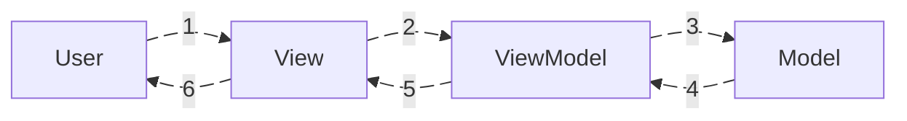

# Lịch sử hình thành

Trước MVVM, cộng đồng .NET chủ yếu dùng:
- **MVC (Model–View–Controller)**
- **MVP (Model–View–Presenter)**

Khi Microsoft chuẩn bị phát hành **WPF (Windows Presentation Foundation)** – một framework UI mới dùng XAML, họ cần một mô hình gắn UI declarative (XAML) với code “logic” sao cho:

- Hỗ trợ **data binding** mạnh
- Tách biệt UI và logic  → Dễ test, dễ bảo trì
- Tận dụng `Command, INotifyPropertyChanged, DependencyProperty`
    
MVC/MVP không tận dụng được triệt để các tính năng này → cần một kiến trúc mới.

**John Gossman**, kiến trúc sư của Microsoft, là người **đề xuất MVVM** vào năm **2005** trong bối cảnh phát triển WPF.

**Kết luận**
MVVM ra đời với vai trò như một giải pháp mới để:
> - tận dụng tối đa các tính năng mà C# đang có tại thời điểm đó, thứ mà các kiến trúc trước đó chưa tận dụng được.
> - Chia nhỏ việc phát triển một tính năng cho các thành viên dự án(Dev, Design, Tester,...)
> - Các dự án có hệ thống UI lớn, phúc tạp sẽ cần tới MVVM.
 

# Cấu tạo & Vai trò


$$
MVVM = Model + View + ViewModel
$$


```img_compare
- [tên gọi](https://github.com/hoangcuongzk1/hoangcuongzk1.github.io/blob/main/docs/shared/post-02/mvvm_txt.png?raw=true)
- [hình thái](https://github.com/hoangcuongzk1/hoangcuongzk1.github.io/blob/main/docs/shared/post-02/mvvm_icon.png?raw=true)
```


MVVM được cấu thành bởi 3 lớp chính:
## Model
- Chứa dữ liệu.
- Thuần dữ liệu, không chứa bất kỳ logic nào cả.
- Là một tập hợp "một" hoặc "nhiều" dữ liệu, miễn là dữ liệu này có thể "được nhìn thấy, tương tác được thông qua UI"  thì nó sẽ là `Model`.

>→ `Model` là các loại dữ liệu có thể được kết xuất ra màn hình để người dùng có thể:
> - quan sát
> - hoặc tương tác.

## View Model
- Là lớp chính giữa, chịu trách nhiệm trung gian kết nối giữa `Model` và `View`.
-  Cách kết nối - sợi dây kết nối mà `View Model` dùng là phương pháp: `Data Binding`(`event`, `callback`,...)
- Chứa logic.
- Logic này chịu trách nhiệm xử lý một `Model`(dữ liệu) cụ thể, khi:
		- dữ liệu này trước khi gửi tới `View` có thay đổi, tinh chỉnh gì không. 
		- cách dữ liệu được thay đổi, khi người dùng tương tác với `view`.

> → `View Model` là:
> - Là lớp trung gian chịu trách nhiệm kết nối, truyền tải "2 chiều" giữa `Model(dữ liệu)` ↔ `view`. 
> - Là nơi dữ liệu được biến đổi trước khi bàn giao cho 2 lớp còn lại.

## View

View là những gì mà người dùng nhìn thấy khi sử dụng ứng dụng, phần mềm.
→ View thể hiện "trạng thái" của dữ liệu, dữ liệu này đại 

View cũng có thể là:
- Nút bấm
- Thanh trượt(slider)
- ô nhập liệu(input)
→ View là "công cụ" mà người dùng sẽ sử dụng để biến đổi dữ liệu.

**Kết luận**
> View là lớp kết nối người dùng với ứng dụng:
> - là lớp thể hiện trạng thái của dữ liệu.
> - Là lớp nhận input từ phía người dùng và gửi về cho `View Model` xử lý.





# Tài liệu tham khảo
- [Model–view–viewmodel - Wikipedia](https://en.wikipedia.org/wiki/Model%E2%80%93view%E2%80%93viewmodel)
- [Patterns - WPF Apps With The Model-View-ViewModel Design Pattern \| Microsoft Learn](https://learn.microsoft.com/en-us/archive/msdn-magazine/2009/february/patterns-wpf-apps-with-the-model-view-viewmodel-design-pattern)
- [Introduction to MVC and MVVM patterns with JavaScript](https://www.linkedin.com/pulse/introduction-mvc-mvvm-patterns-javascript-bilal-sevinc-zqcfc/)
- 