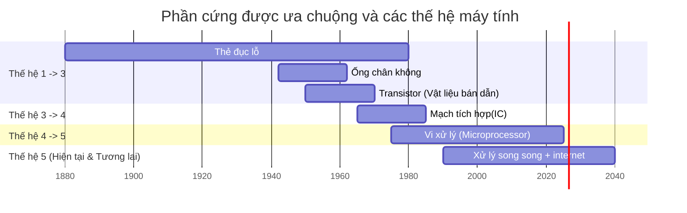

# Mở bài

Bản thân tôi khi mới bắt đầu học lập trình, cũng đã từng rất bối rối khi tìm hiểu về các design pattern như:

- MVC
- MVVM
- ECS
- ...
    

Sau này, khi đã trải qua nhiều dự án và đã áp dụng một trong những pattern trên để hoàn thành công việc hàng ngày, tôi chợt nhận ra bản thân mình chưa thực sự hiểu chúng một cách tường tận như tôi tưởng.

Bản thân pattern (mẫu) đã là một _shortcut_ (lối tắt) để ta bỏ ít công sức mà vẫn đạt hiệu quả cao. Chính vì lẽ đó mà mỗi khi một vấn đề, công việc được giải quyết xong, ta chẳng còn mặn mà với việc đặt câu hỏi hay tìm hiểu:

- tại sao ứng dụng/phần mềm này lại dễ dàng mở rộng tới vậy khi sử dụng kiến trúc A?
- tại sao trong tình huống B này nên dùng kiến trúc C thay vì kiến trúc A?
- ai là người tạo ra kiến trúc D? tại sao họ làm vậy?
- kiến trúc E có tối ưu hiệu năng hơn kiến trúc F không?
- ...
    

Chính vì vậy, chúng ta sẽ cùng nhau đi ngược lại một chút về quá khứ, tìm hiểu nguồn gốc và quá trình hình thành của chúng.

Việc hiểu rõ cội nguồn của một kiến trúc không chỉ giúp ta ghi nhớ tốt hơn, mà quan trọng hơn, nó tạo ra một nền tảng tư duy vững chắc để:
- hiểu vì sao một kiến trúc được sinh ra
- bối cảnh lịch sử và công nghệ cụ thể tại thời điểm nó được sinh ra
- nhận diện đúng loại vấn đề mà kiến trúc đó giải quyết
- nhìn thấy rõ những đánh đổi (trade-off) về độ phức tạp, hiệu năng, khả năng mở rộng, hiệu quả kinh tế
- và từ đó có thể tự do kết hợp, điều chỉnh, thậm chí sáng tạo ra những kiến trúc phù hợp hơn cho hệ thống của riêng mình.

Đây sẽ là một series tương đối dài. Trong nội dung bài viết này, chúng ta sẽ tập trung vào việc nắm tổng quan:
- quá trình kiến trúc phần mềm được hình thành
- bối cảnh lịch sử thời điểm đó
- những kiến trúc còn hiện hữu tới tận ngày nay
## Quy ước khi đọc - reading conventions
Trong các bài viết của chuỗi bài (series) này, chúng ta sẽ thống nhất sử dụng thuật ngữ **"kiến trúc"** thay cho _design pattern_, theo quan điểm cá nhân của tôi, từ _kiến trúc_ sát nghĩa hơn, bởi nó phản ánh **cách tổ chức tổng thể của một hệ thống**, chứ không chỉ là một mẹo hay công thức áp dụng cục bộ. Trên thực tế, khái niệm _pattern_ cũng có nguồn gốc từ ngành xây dựng – một lĩnh vực có tuổi đời lâu hơn rất nhiều so với ngành lập trình.

Tên của kiến trúc hoặc các từ khoá (keyword) liên quan sẽ sử dụng từ gốc tiếng anh. Tôi làm vậy là để thống nhất giữa các tài liệu khác nhau ở trên internet, cũng như việc ghi nhớ keyword sẽ giúp cả tôi và các bạn dễ dàng tra cứu thêm các tài liệu liên quan hơn.


---

# Lịch sử phát triển
Muốn hiểu được kiến trúc phần mềm, ta cần phải tìm hiểu về một thứ quan trọng hơn cả, đó là **phần cứng của máy tính**.

Quan sát hình thù, cấu tạo của các máy tính qua các thời kỳ, ta có thể thấy sự thay đổi rõ rệt từ những cỗ máy khổng lồ, chiếm cả căn phòng, đến những thiết bị nhỏ gọn, cá nhân.

Quá trình phát triển của các kiến trúc phần mềm cũng tương phản rõ rệt với sự tiến hoá của phần cứng.




## 1. Thời kỳ sơ khai(1890s - 1950s)

### Thẻ đục lỗ

|  |  |
| ----------------------------------------------------------------------------- | ------------------------------------------------------------- |

Nếu các bạn cũng giống tôi khi tìm hiểu tới đây, tò mò muốn biết cách các máy tính đục lỗ hoạt động ra sao, thì hãy đọc [bài viết này](https://hoangcuongzk1.xynok.com/devlog/post-03).

|Thẻ đục lỗ|Hệ thống hiện đại|
|---|---|
|Lỗ / không lỗ|Bit 1 / 0|
|Thẻ|File|
|Deck thẻ|Program / Data pipeline|
|Batch|Job, Task, Build|
|Máy đọc|Parser / Loader|

Ở giai đoạn đầu của ngành(những năm 1890–1960), phần lớn chương trình chạy trên [Punch Card - thẻ đục lỗ](https://en.wikipedia.org/wiki/Punched_card). Giai đoạn này là giai đoạn chưa tồn tại khái niệm **giao diện người dùng**.


- Ở giai đoạn này, ứng dụng thường rất đơn giản và trực tiếp. Mục đích chính là xử lý dữ liệu đầu vào và xuất kết quả.
- Loài người đang dần chuyển từ việc sử dụng máy tính cho các phép tính khoa học sang các ứng dụng kinh doanh và quản lý dữ liệu.
- Máy tính là một thứ xa xỉ, đắt đỏ, và chỉ có các chuyên gia mới có thể tiếp cận.

> Cấu tạo của các máy tính trong giai đoạn này rất cồng kềnh so với hiện tại, nên xu thế chung của các công ty công nghệ thời kỳ này là tập trung phát triển, thử nghiệm các loại **phần cứng** tối giản và linh hoạt hơn, phần mềm lúc này chưa phải là ưu tiên hàng đầu.
> 
> → kiến trúc phần mềm chưa được chú trọng.


---

## 2. GUI ra đời và vấn đề bắt đầu xuất hiện

Khi **GUI (Graphical User Interface)** xuất hiện (1980s):

- Chuột
    
- Cửa sổ
    
- Button, menu, dialog
    

Ứng dụng bắt đầu có:

- Nhiều màn hình
    
- Nhiều tương tác
    
- Nhiều trạng thái (state)
    

Và vấn đề lộ rõ:

- Code xử lý nghiệp vụ bị trộn lẫn với code vẽ UI
    
- Mỗi thay đổi nhỏ của UI có thể phá vỡ logic
    
- Rất khó test
    

Lúc này, cộng đồng bắt đầu **tìm cách tách UI ra khỏi logic**.

---

## 3. MVC – bước tách đầu tiên

### Bối cảnh ra đời

**MVC (Model – View – Controller)** được giới thiệu lần đầu bởi **Trygve Reenskaug** tại Xerox PARC (1979), trong quá trình phát triển Smalltalk.

Mục tiêu ban đầu rất đơn giản:

> Tách dữ liệu, hiển thị và xử lý tương tác người dùng thành các phần riêng biệt.

### Cấu trúc

- **Model**: dữ liệu + nghiệp vụ
    
- **View**: hiển thị
    
- **Controller**: xử lý input, điều phối
    

```text
User → Controller → Model
              ↓
            View
```

### Điểm mạnh

- Tách trách nhiệm rõ ràng
    
- Làm nền móng cho hầu hết kiến trúc UI sau này
    

### Vấn đề phát sinh

- View và Controller thường dính chặt vào nhau
    
- Khó áp dụng thuần khi UI phức tạp
    
- Dễ biến thành "Massive Controller"
    

---

## 4. MVP – khi Controller trở nên quá tải

### Vì sao cần MVP?

Trong nhiều ứng dụng GUI (đặc biệt là WinForms, Swing):

- Controller phình to
    
- View chứa logic ngầm
    

**MVP (Model – View – Presenter)** xuất hiện để giải quyết vấn đề này.

### Khác biệt cốt lõi

- View trở nên _passive_ (bị động)
    
- Presenter xử lý toàn bộ logic UI
    
- View chỉ expose interface
    

```text
User → View → Presenter → Model
               ↓
             View
```

### Ưu điểm

- Test dễ hơn
    
- View đơn giản
    

### Nhược điểm

- Presenter dễ phình to
    
- Nhiều code "glue" (kết nối)
    

---

## 5. MVVM – kỷ nguyên Data Binding

### Bối cảnh

Khi Microsoft phát triển **WPF** (2006–2008), họ cần:

- UI declarative (XAML)
    
- Binding dữ liệu hai chiều
    
- Tách UI khỏi logic triệt để
    

Kết quả là **MVVM (Model – View – ViewModel)**.

### Điểm khác biệt then chốt

- **ViewModel không biết View**
    
- Giao tiếp thông qua _data binding_
    
- State trở thành trung tâm
    

```text
View ↔ Binding ↔ ViewModel ↔ Model
```

### Ưu điểm

- Test tốt
    
- Phù hợp UI phức tạp
    
- Rất mạnh khi framework hỗ trợ binding
    

### Đánh đổi

- Phụ thuộc framework
    
- Debug binding không dễ
    

---

## 6. Nhìn lại: kiến trúc là sản phẩm của thời đại

Không có kiến trúc nào "tốt nhất".

Mỗi kiến trúc sinh ra để giải quyết:

- Một loại UI cụ thể
    
- Một hạn chế của công nghệ tại thời điểm đó
    
- Một bài toán phổ biến của thời đại
    

MVC → MVP → MVVM **không phải là tiến hóa tuyến tính**, mà là **những nhánh rẽ song song**.

---

## 7. Điều quan trọng nhất

Hiểu kiến trúc không phải để:

- Thuộc sơ đồ
    
- Áp dụng máy móc
    

Mà để:

- Biết _vì sao_ nó tồn tại
    
- Biết _khi nào_ nên dùng
    
- Và quan trọng hơn: **khi nào không nên dùng**
    

Ở các phần tiếp theo, chúng ta sẽ bóc tách từng kiến trúc một cách chi tiết hơn, từ góc nhìn lịch sử, kỹ thuật và cả những đánh đổi phía sau mỗi lựa chọn thiết kế.