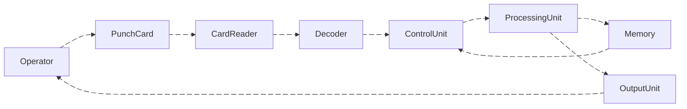

# Nguồn gốc
Trước khi đi vào cách một máy tính đục lỗ hoạt động ra sao, ta cần phải tìm hiểu xem nguồn gốc của punched card(thẻ đục lỗ) có từ đâu.

Ứng dụng cơ khi đầu tiên của thẻ đục lỗ có từ năm 1804, đó là phát minh máy dệt của [Jacquard machine - Wikipedia](https://en.wikipedia.org/wiki/Jacquard_machine).

## Cách hoạt động của máy dệt Jacquard

|  |  |
| ------------------------------------------------------------------------------------------------------------------------------------------------------ | ------------------------------------------------------------------------------------------------------------------------------------------------------------------------- |
Mỗi thẻ đại diện cho **1 hàng dệt**.

[The Virtual Keypunch – Make Your Personal Punch Card](https://www.masswerk.at/keypunch/)

- [Jacquard machine - Wikipedia](https://en.wikipedia.org/wiki/Jacquard_machine)
- [Binary and the Jacquard Mechanism - demonstration - YouTube](https://www.youtube.com/watch?v=pzYucg3Tmho&t=183s)
