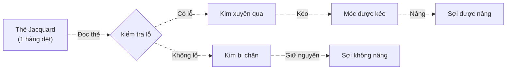
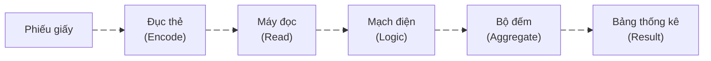

# Nguồn gốc

Trước khi đi vào cách một máy tính đục lỗ hoạt động ra sao, ta cần phải tìm hiểu xem punched card (thẻ đục lỗ) xuất hiện từ đâu và vì sao con người lại nghĩ tới việc lưu trữ thông tin bằng các lỗ trên vật liệu vật lý.


## Máy dệt Jacquard

Cuối thế kỷ 18 – đầu thế kỷ 19, ngành dệt là một trong những ngành công nghiệp phức tạp nhất. Việc dệt các hoa văn nhiều lớp yêu cầu:

- Thợ có tay nghề rất cao
- Khó sao chép chính xác
- Gần như không thể tự động hoá

Năm 1804, Joseph Marie Jacquard giới thiệu [Jacquard machine – Wikipedia](https://en.wikipedia.org/wiki/Jacquard_machine), sử dụng thẻ đục lỗ (punched cards) để điều khiển quá trình dệt.

### Cơ chế hoạt động

|Các thẻ Jacquard|Kết quả dệt|
|---|---|
|||




    

Nếu diễn giải theo ngôn ngữ hiện đại:

| Jacquard  | Máy tính             |
| --------- | -------------------- |
| Có lỗ     | 1                    |
| Không lỗ  | 0                    |
| Một thẻ   | Một file/instruction |
| Chuỗi thẻ | Chương trình         |
| Máy dệt   | CPU cơ khí           |

Chuỗi thẻ liên tiếp chính là:
- Một chương trình
- Được thực thi tuần tự
- Có thể thay đổi hành vi máy bằng cách thay bộ thẻ
    

```callout
[!NOTE] Ý nghĩa tư duy
Máy dệt Jacquard không phải máy tính, nhưng nó đặt nền móng cho khoa học máy tính:
1. Tách “chương trình” khỏi “máy”
2. Dữ liệu được mã hoá dưới dạng nhị phân vật lý
3. Tự động hoá dựa trên dữ liệu, không dựa trên con người
```


---

## Herman Hollerith & điều tra dân số Mỹ

| Máy lập bảng Hollerith (1890)                                                                                       | Thẻ Hollerith                                                                                           |
| ------------------------------------------------------------------------------------------------------------------- | ------------------------------------------------------------------------------------------------------- |
|  |  |


Cuối thế kỷ 19, Hoa Kỳ đối mặt với một vấn đề nghiêm trọng:  
Dân số tăng quá nhanh, trong khi việc xử lý dữ liệu điều tra dân số hoàn toàn thủ công.

- Điều tra năm 1880 mất gần 8 năm để tổng hợp
- Nếu tiếp tục như vậy, cuộc điều tra nằm 1890 có thể chưa xong thì cuộc điều tra tiếp theo đã phải bắt đầu (do dân số tăng nhanh hơn lần điều tra trước đó).

Herman Hollerith đã tạo ra một chiếc máy thay đổi cách mà chúng ta hay làm để lưu trữ thông tin. Thay vì lưu trữ cụ thể hoá thông tin như cách thông thường, ta mã hoá chúng. Hay nói cách khác, ta lưu trữ chúng dưới một định dạng tối giản, gọn gàng hơn, nhưng khi lấy ra vẫn đảm bảo thông tin chính xác.


### Cách thẻ lưu trữ thông tin

Trước khi bắt đầu phân tích, một lưu ý cho các bạn đọc là đừng cố hiểu và tập trung quá vào các ký tự trên thẻ. Bản thân chúng là một tập hợp các ký tự đã được quy ước để đại diện cho một loại thông tin nào đó, nên việc chúng ta chẳng hiểu chúng có ý nghĩa gì là điểu hiển nhiên (do chúng ta đâu biết quy ước là gì đâu).

Trên thực tế, ứng dụng của Hollerith có thể đã được tái sử dụng cho nhiều công việc liên quan đến lưu trữ thông tin khác nhau (không chỉ dừng lại ở việc điều tra dân số). Chính vì vậy cấu trúc chung của các loại thẻ được chia làm 2 phần chính:


1. **Phần định danh quy ước**
- Quy ước các loại thông tin mà thẻ lưu trữ
- Là các ký hiệu giúp người nhập liệu và máy đọc thẻ có thể phân biệt được các loại thông tin theo từng hàng/cột

2. **Phần thông tin mã hoá**
- Là giá trị của các thông tin 
- Đại diện cho một miền giá trị, không phải một giá trị cụ thể
- Được biểu diễn thông qua việc tại cột/hàng đó có lỗ hay không lỗ.

> Lấy ví dụ cho việc điều tra dân số:
> - Họ KHÔNG lưu “văn bản hoàn chỉnh”
> - Họ lưu thuộc tính dân số → mỗi cột = 1 câu hỏi, lỗ = câu trả lời

Thay vì ghi: *Nam, 32 tuổi, độc thân, công nhân, nhập cư*

Họ biến thành:

- Cột 5: Giới tính  
- Cột 6–7: Nhóm tuổi  
- Cột 8: Hôn nhân  
- Cột 9: Nghề nghiệp  
- Cột 10: Quốc tịch
- ... vân vân

Mỗi hàng trong thẻ sẽ có quy ước sẵn tới một miền giá trị, ví dụ:

| Hàng | Tuổi  |
| ---- | ----- |
| 1    | 0–9   |
| 2    | 10–19 |
| 3    | 20–29 |
| 4    | 30–39 |
| …    | …     |

Dựa vào nguyên tắc quy ước và mapping dữ liệu, việc lưu trữ trở nên gọn gàng hơn, nhanh chóng hơn → nhiều loại thông tin sẽ được lưu trữ hơn.


### Tổng quan hệ thống Hollerith


Hollerith không tạo ra “một cái máy”, mà là một hệ thống xử lý dữ liệu hoàn chỉnh, gồm:



Hệ thống gồm 4 thành phần chính:
1. Phiếu điều tra giấy (input thô)
2. Thẻ đục lỗ (dữ liệu số hoá)
3. Máy đọc & máy lập bảng (processing)
4. Bộ đếm & bảng thống kê (output)
    

---

#### Giai đoạn 1: Thu thập dữ liệu

Phiếu điều tra giấy

- Nhân viên điều tra đến từng hộ gia đình
- Ghi thông tin lên phiếu giấy truyền thống
- Dữ liệu lúc này:
    - Không chuẩn hoá
    - Không thể xử lý tự động
    - Chỉ đọc được bằng con người

---

#### Giai đoạn 2: Mã hoá dữ liệu lên thẻ đục lỗ

- Mỗi thẻ đục lỗ đại diện cho 1 người
- Kích thước thẻ được chuẩn hoá
- Các vị trí trên thẻ được quy ước trước ý nghĩa
    

Ví dụ (giản lược):

| Vị trí | Ý nghĩa             |
| ------ | ------------------- |
| Cột A  | Giới tính           |
| Cột B  | Nhóm tuổi           |
| Cột C  | Tình trạng hôn nhân |
| Cột D  | Nghề nghiệp         |
| …      | …                   |

Quy trình đục thẻ
1. Nhân viên đọc phiếu giấy
2. Dùng máy đục thẻ thủ công
3. Đục lỗ tương ứng với từng thuộc tính
4. Kiểm tra lại bằng mắt

---

#### Giai đoạn 3: Máy đọc thẻ – trái tim của hệ thống

Máy đọc gồm:

- Bàn đặt thẻ
- Hệ thống kim kim loại (pins)
- Bề mặt tiếp điểm (thủy ngân hoặc kim loại)
- Nguồn điện
- Bộ đếm cơ khí

---

**Cơ chế đọc chi tiết (điện – cơ)**

Quy trình đọc một thẻ:
1. Đặt thẻ lên bàn đọc
2. Hạ khung kim xuống
3. Với mỗi kim:
    - Nếu va chạm → kim không xuyên → mạch hở
    - Nếu đi qua lỗ → kim xuyên qua → chạm tiếp điểm
4. Khi chạm tiếp điểm:
    - Mạch điện khép kín
    - Dòng điện chạy
    - Kích hoạt bộ đếm tương ứng    

---

#### Giai đoạn 4: Đếm và thống kê

 **Bộ đếm cơ khí**
- Mỗi bộ đếm đại diện cho một nhóm thống kê
- Có thể gán lại cấu hình tuỳ bài toán

Ví dụ:

- Bộ đếm 1: Nam
- Bộ đếm 2: Nữ
- Bộ đếm 3: Trên 40 tuổi
- Bộ đếm 4: Nghề nông
    
Một thẻ có thể kích hoạt nhiều bộ đếm cùng lúc.

👉 Đây chính là `vectorized processing` ở mức cơ khí.

---

**Thống kê chéo (Cross-tabulation)**

Điểm cực kỳ tiên tiến của hệ thống Hollerith là khả năng:

> Đếm nhiều thuộc tính đồng thời trên cùng một bản ghi

Bằng cách:
- Cấu hình mạch điện
- Gán bộ đếm
- Chạy nhiều vòng đọc

Ví dụ:
- Vòng 1: thống kê giới tính → 1000 người là nữ giới
- Vòng 2: thống kê nghề nghiệp → 450 người làm nghề cơ khí, 550 người làm nội trợ
- Vòng 3: thống kê theo bang → 100 người thuộc bang A, 200 người thuộc bang B, ...
    

> Đây chính là tiền thân của:
> - `GROUP BY`
> - `FILTER`
> - `MULTI-PASS DATA PROCESSING`

---

#### Giai đoạn 5: Phân loại & sắp xếp thẻ

Ngoài máy đọc, hệ thống còn có máy phân loại thẻ (Sorter).
- Thẻ được đọc
- Dựa trên lỗ ở vị trí chỉ định
- Thẻ được đẩy vào ngăn tương ứng

Ví dụ:
- Nam → ngăn A
- Nữ → ngăn B
    
> Đây là physical partitioning, tương đương:
> - `Sharding`
> - `Bucket sort`
    
---

#### Tổng kết máy Hollerith

Không có CPU.  Không có RAM.  Không có phần mềm. Nhưng:
- Có dữ liệu
- Có logic
- Có pipeline
- Có batch processing
    

Hệ thống của Hollerith lần đầu tiên:
1. Biến thông tin xã hội → dữ liệu nhị phân
2. Tách lưu trữ khỏi xử lý
3. Cho phép xử lý hàng triệu bản ghi lặp lại
4. Thực hiện thống kê tự động, không cần hiểu dữ liệu
    
👉 Đây là data processing system, không còn là máy cơ khí đơn lẻ.

```callout
[!IMPORTANT] Thành tựu
1. Điều tra dân số 1890 hoàn thành nhanh hơn
2. Đánh dấu sự ra đời của:
- Áp dụng nguyên lý điện học trong việc quản lý thông tin
- Xử lý dữ liệu hàng loạt (batch processing)
```


Một cỗ máy Hollerith gồm rất nhiều thành phần, nên Hollerith có rất nhiều công ty, mỗi công ty chịu trách nhiệm sản xuất một phần của cỗ máy. Sau này, tất cả các công ty của Hollerith đã hợp nhất và trở thành [IBM - International Business Machines](https://www.ibm.com/us-en).


---
# Sự ra đời của IBM và máy IBM 029

Như đã đề cập từ phần trên, cỗ máy của Hollerith sau khi đạt được thành công với việc điều tra dân số, nó đã được dùng cho nhiều mục đích khác. Và vì thế, thiết kế của thẻ phải được:
- Chuẩn hoá kích thước thẻ
- Chuẩn hoá quy trình xử lý

Tất cả nhằm mục đích lưu trữ, mã hoá được nhiều thông loại tin hơn.


IBM chuẩn hoá thẻ 80 cột, với cấu trúc:
- 12 hàng × 80 cột
- Mỗi cột đại diện cho 1 ký tự
- Mỗi ký tự được mã hoá bằng tổ hợp lỗ

Với thẻ IBM chuẩn, không chỉ lưu trữ thông tin, IBM còn lưu trữ các chương trình trong thẻ. Thật vậy, bản thân mỗi thẻ có thể cấu hình, quy định xem loại thông tin nào sẽ được nhập.

# 1. Thẻ đục lỗ (Punched Card) – cấu trúc & nguyên lý

## 1.1 Kích thước & bố cục vật lý

**Chuẩn IBM Hollerith 80 cột**:

- Kích thước: **7 3/8 × 3 1/4 inch** (~187 × 83 mm)
    
- Chất liệu: giấy cứng (cardstock)
    
- **80 cột (columns)** – mỗi cột biểu diễn **1 ký tự**
    
- **12 hàng (rows)** cho mỗi cột:
    

|Tên hàng|Ký hiệu|Ý nghĩa|
|---|---|---|
|Row 12|12|Zone punch|
|Row 11|11|Zone punch|
|Row 0|0|Zone punch|
|Row 1–9|1–9|Digit punches|

👉 **Một ký tự = tổ hợp lỗ theo hàng trong cùng một cột**

---

## 1.2 Cách mã hoá dữ liệu (Encoding)

### a) Số (0–9)

- Chỉ đục **1 lỗ duy nhất** tại hàng tương ứng
    

|Số|Lỗ|
|---|---|
|0|Row 0|
|1|Row 1|
|…|…|
|9|Row 9|

---

### b) Chữ cái (A–Z)

- **Luôn là tổ hợp 2 lỗ**
    
- 1 lỗ **zone** + 1 lỗ **digit**
    

|Chữ|Zone|Digit|
|---|---|---|
|A|12|1|
|B|12|2|
|…|…|…|
|I|12|9|
|J|11|1|
|…|…|…|
|R|11|9|
|S|0|2|
|…|…|…|
|Z|0|9|

👉 Đây là **mã Hollerith**, không phải ASCII.

---

### c) Ký tự đặc biệt

- Kết hợp **zone + digit đặc biệt**
    
- Ví dụ: `+ - / $ , .`
    

---

## 1.3 Bản chất logic của thẻ đục lỗ

Thẻ **không chứa dữ liệu theo nghĩa điện tử**, mà chỉ chứa:

> **Thông tin hình học (có lỗ / không lỗ)**

Dữ liệu chỉ “sống” khi:

- Kim dò đi qua lỗ
    
- Mạch điện đóng
    
- Tín hiệu được ghi nhận
    

👉 Thẻ đục lỗ = **ROM vật lý dùng 1 lần**

---

# 2. Máy IBM 029 (Keypunch 029)

IBM 029 là **máy nhập liệu**, không phải máy tính đúng nghĩa.

Vai trò:

> **Con người → bàn phím → đục lỗ → thẻ → máy xử lý**

---

## 2.1 Cấu trúc tổng thể IBM 029

### Các khối chính:

```
[Bàn phím] 
   ↓
[Bộ mã hoá ký tự]
   ↓
[Solenoid cơ điện]
   ↓
[Đầu đục]
   ↓
[Thẻ giấy]
```

---

## 2.2 Bàn phím (Keyboard)

- Bố cục gần giống **typewriter**
    
- Mỗi phím:
    
    - Không in chữ
        
    - Mà **tạo mã Hollerith tương ứng**
        

Ví dụ:

- Nhấn `A` → máy biết cần đục:
    
    - Row 12
        
    - Row 1
        

---

## 2.3 Bộ mã hoá (Character Encoder)

Đây là **trí não logic của IBM 029**:

- Bảng ánh xạ:
    
    ```
    Ký tự → {row12?, row11?, row0?, row1–9?}
    ```
    
- Hoạt động bằng:
    
    - Relay
        
    - Diode logic
        
    - Không có CPU
        

👉 Có thể xem đây là **hard-coded lookup table bằng phần cứng**

---

## 2.4 Cơ chế đục lỗ (Punching Mechanism)

### Nguyên lý cơ điện:

- Mỗi hàng có **1 solenoid**
    
- Khi cần đục:
    
    1. Solenoid được cấp điện
        
    2. Đẩy **kim đục (punch pin)** xuống
        
    3. Xuyên qua thẻ
        
    4. Cắt giấy → tạo lỗ tròn
        
    5. Mảnh giấy rơi xuống **chad box**
        

👉 Một ký tự = kích hoạt **nhiều solenoid cùng lúc**

---

## 2.5 Dịch chuyển thẻ (Card Stepping)

- Sau khi đục xong 1 cột:
    
    - Motor kéo thẻ sang **cột kế tiếp**
        
- Chính xác cơ học cực cao
    
- Lệch < 0.1 mm là **đọc sai toàn bộ**
    

---

## 2.6 Verify mode (chế độ kiểm tra)

IBM 029 có **Verify**:

- Đưa thẻ đã đục vào
    
- Người gõ lại dữ liệu
    
- Máy **không đục**, chỉ **đọc lỗ**
    
- Nếu khác → báo lỗi
    

👉 Đây là **CRC / checksum thủ công thời tiền số**

---

# 3. Quy trình làm việc hoàn chỉnh (Data Pipeline)

```
Con người
  ↓
IBM 029 (Keypunch)
  ↓
Thẻ đục lỗ
  ↓
Máy đọc thẻ (Card Reader)
  ↓
Xung điện (bit)
  ↓
Mainframe (IBM 1401 / 360)
```

---

## 3.1 Máy đọc thẻ đọc như thế nào?

- 80 cột × 12 kim dò
    
- Kim rơi xuống:
    
    - Gặp lỗ → chạm tiếp điểm → đóng mạch
        
    - Không lỗ → hở mạch
        
- Tạo thành **vector 12-bit / cột**
    

👉 Một thẻ = **ma trận 80 × 12 bit**

---

## 3.2 So sánh với máy tính hiện đại

|Thẻ đục lỗ|Máy hiện đại|
|---|---|
|Lỗ / không lỗ|Bit 1 / 0|
|Kim dò|Transistor|
|Relay|Logic gate|
|Thẻ|File|
|Chồng thẻ|Batch processing|

👉 **Batch processing** bắt nguồn từ thẻ đục lỗ.

---

# 4. Góc nhìn hệ thống (rất quan trọng)

Nếu nhìn như kỹ sư hệ thống:

- Thẻ đục lỗ = **Data Serialization**
    
- IBM 029 = **Input Device + Encoder**
    
- Máy đọc = **Deserializer**
    
- Mainframe = **CPU**
    

> Toàn bộ hệ sinh thái này chính là **máy tính hiện đại bị “trải phẳng” thành cơ khí**

---

# 5. Tại sao IBM 029 & thẻ đục lỗ quan trọng?

- Đặt nền móng cho:
    
    - ASCII
        
    - File text
        
    - Compiler
        
    - Batch job
        
- Tạo ra:
    
    - Nghề **programmer**
        
    - Khái niệm **syntax error**
        
- Ảnh hưởng trực tiếp đến:
    
    - Fortran
        
    - COBOL
        
    - C (80-column source code)
        

👉 **80 cột trong code editor ngày nay là di sản trực tiếp**

---

Nếu bạn muốn, mình có thể:

- Vẽ **Mermaid flowchart chi tiết cấp tín hiệu**
    
- So sánh **Hollerith vs ASCII bit-level**
    
- Phân tích **IBM 029 dưới góc nhìn máy trạng thái (FSM)**
    
- Hoặc liên hệ trực tiếp sang **pipeline ECS / DOTS / data-oriented design**
    

Chỉ cần nói hướng bạn muốn đào sâu.

---

# Nguồn tham khảo
- [Jacquard machine – Wikipedia](https://en.wikipedia.org/wiki/Jacquard_machine)
- [Binary and the Jacquard Mechanism – YouTube](https://www.youtube.com/watch?v=pzYucg3Tmho)
- [1889 Herman Hollerith Census Machine by TMC which became IBM - YouTube](https://www.youtube.com/watch?v=9HXjLW7v-II)
- [Hollerith tabulating machine – Wikipedia](https://en.wikipedia.org/wiki/Tabulating_machine)
- [IBM 029 Card Punch – IBM Archives](https://www.ibm.com/ibm/history/exhibits/vintage/vintage_4506VV4024.html)
- [Anatomy of a Hollerith Card](https://www.eecis.udel.edu/~mills/gallery/gallery9.html)
- [Hollerith 1890 Census Tabulator](https://www.columbia.edu/cu/computinghistory/census-tabulator.html)
- [The punched card \| IBM](https://www.ibm.com/history/punched-card)
- [EBCDIC - Wikipedia](https://en.wikipedia.org/wiki/EBCDIC)
- [1964 IBM 029 Keypunch Card Punching Demonstration - YouTube](https://www.youtube.com/watch?v=YnnGbcM-H8c)
- [The Virtual Keypunch – Make Your Personal Punch Card](https://www.masswerk.at/keypunch/)
