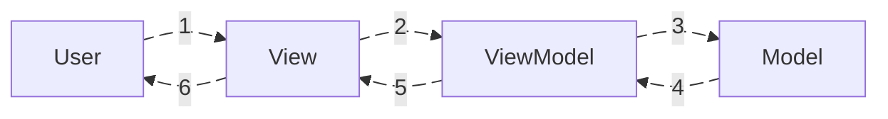

# The Origin Story

Before MVVM came into the picture, the .NET community mainly relied on:
- **MVC (Model–View–Controller)**
- **MVP (Model–View–Presenter)**

When Microsoft prepared to introduce **WPF (Windows Presentation Foundation)**—a modern, XAML-based UI framework—they needed an architectural pattern that could seamlessly connect declarative UI with application logic. This new pattern had to:

- Fully embrace **powerful data binding**
- Maintain a clean separation between UI and logic → improving testability and maintainability
- Leverage key technologies such as `Command`, `INotifyPropertyChanged`, and `DependencyProperty`

Since MVC and MVP did not take full advantage of these capabilities, a new design approach was required.

That solution came in **2005**, when **John Gossman**, a Microsoft architect, proposed the **MVVM** pattern specifically for WPF’s development.

**In short**, MVVM was created to:
> - Make full use of C# and WPF’s advanced tooling, which earlier patterns couldn’t leverage.
> - Support a clean division of responsibilities among developers, designers, and testers.
> - Provide a scalable architecture for applications with large, complex UIs.

---

# Composition & Responsibilities

$$
MVVM = Model + View + ViewModel
$$

```img_compare
- [Names](https://github.com/hoangcuongzk1/hoangcuongzk1.github.io/blob/main/docs/shared/post-02/mvvm_txt.png?raw=true)
- [Visual Form](https://github.com/hoangcuongzk1/hoangcuongzk1.github.io/blob/main/docs/shared/post-02/mvvm_icon.png?raw=true)
````

MVVM is made up of three core layers:

---

## Model

- Holds the data.
- Pure data—contains **no logic**.
- Represents _one or multiple_ units of information that can be _displayed or interacted with_ through the UI.
    

> → In essence, the **Model** represents any data that can be shown to the user for:
> - observation
> - or interaction.


## ViewModel

- Acts as the intermediary connecting the `Model` and the `View`.
- Communicates through **data binding** (events, callbacks, reactive updates).
- Contains the business logic.
- Prepares and transforms data before it reaches the UI and handles changes triggered by user interactions.
    

> → The **ViewModel**:
> - Bridges the flow of information between `Model (data)` ↔ `View (UI)` in both directions.
> - Serves as the place where data is shaped before being delivered to either side.


## View
The View is everything the user sees and interacts with.
It displays the _current state_ of the data and can take many forms:
- Buttons
- Sliders
- Input fields
- Layout containers

→ The View is the user's tool to manipulate and observe information.

**In summary:**

> The View connects the user with the application:
> - It displays the _state_ of the data.
> - It receives user input and passes it back to the **ViewModel** for processing.





# References
- [Model–view–viewmodel - Wikipedia](https://en.wikipedia.org/wiki/Model%E2%80%93view%E2%80%93viewmodel)
- [Patterns - WPF Apps With The Model-View-ViewModel Design Pattern \| Microsoft Learn](https://learn.microsoft.com/en-us/archive/msdn-magazine/2009/february/patterns-wpf-apps-with-the-model-view-viewmodel-design-pattern)
- [Introduction to MVC and MVVM patterns with JavaScript](https://www.linkedin.com/pulse/introduction-mvc-mvvm-patterns-javascript-bilal-sevinc-zqcfc/)